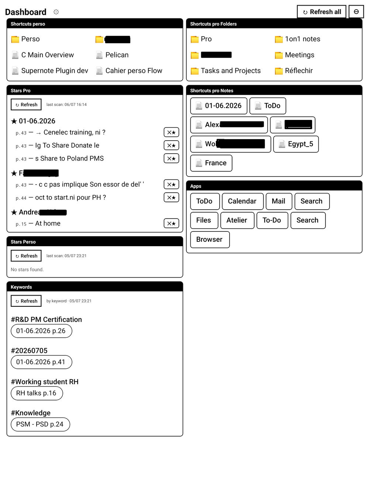

# Dashboard for Supernote

[](LICENSE)
[](https://ko-fi.com/agp42)

A configurable, always‑available **dashboard** for Supernote e‑ink devices. A draggable **⊕ bubble**
floats over everything; tap it to open a dashboard you compose yourself from **shortcuts**, **recent
files**, **stars**, **keywords**, and **app launchers**. Fully on‑device and offline.

Works on **A5X**, **A5X2 (Manta)** and **Nomad** (Supernote developer/beta firmware with the plugin
system).



## Features

- **Bubble** launcher (3 looks) that persists over notes, folders, and apps — tap to open,
  long‑press to close, drag to move.
- **Shortcuts** to folders, notes, and PDFs — one tap; list / grid / inline. Add several at once
  with a full‑page multi‑select browser.
- **Recent** — recently‑opened notes & PDFs, read live (no scan). The device tracks the last 8, so 8 max.
- **Stars** — every starred page across your notes, grouped by note, with an optional **line
  preview**: the line's **handwriting image**, or **OCR text with an automatic image fallback** when
  recognition fails. Delete a single star from the dashboard (keeps the handwriting).
- **Keywords** — your notes' keywords as tappable chips; each opens its exact note + page.
- **Apps** — launch ToDo, Calendar, Document, Search, Files… (or any installed app).
- **Guided setup** — a 3‑step wizard (Look · Sections · Content); everything autosaves.
- **Save / load** named configurations (guards against an accidental Reset).
- Themes (Ledger / Boxed / Airy), 1‑ or 2‑column masonry, adjustable text size, per‑section scan
  folders & sorting, and an **incremental scan** cache (only re‑scans edited notes).

## Install

1. Download **[`dist/dashboard.snplg`](dist/dashboard.snplg)** (or from the [Releases](../../releases),
   or build it — see below).
2. Copy it into the **`MyStyle`** folder on your Supernote.
3. On the device: **Settings → Apps → Plugins → Add Plugin → dashboard**.

Full instructions and how to use every feature: **[USER_GUIDE.md](USER_GUIDE.md)**.

## Build from source

React Native **0.79.2** (locked to the device runtime), `sn-plugin-lib`, JDK 19+, Android SDK 35.

```bash
npm install
chmod +x buildPlugin.sh android/gradlew
./buildPlugin.sh          # → build/outputs/dashboard.snplg
```

## For plugin developers

- **[docs/FINDINGS.md](docs/FINDINGS.md)** — a field guide of everything learned building this:
  opening notes/PDFs/apps by intent, the floating overlay, gestures, the scan APIs, build/deploy
  quirks, device differences. Not in the official docs; verified on real hardware.
- **[.claude/skills/supernote-plugin-dev](.claude/skills/supernote-plugin-dev)** — a Claude Code
  skill (API quick‑reference + patterns + firmware‑verified gotchas) for building Supernote plugins.

Official Supernote developer docs (the source of truth): https://docs.supernote.com/en

## Credits

- The bundled Claude Code skill is adapted from [Laumss/Inkling](https://github.com/Laumss/Inkling)
  (MIT).
- Research informed by the Supernote plugin community (see FINDINGS.md).

## Support

If you enjoy this plugin, please consider [sponsoring a few tokens](https://ko-fi.com/agp42) ;-)
My time and skills are free — the AI tokens behind this plugin are not!
Thank you for your support ☕

## License

[MIT](LICENSE) © 2026 AgP42
