# Dashboard for Supernote — User Guide

Dashboard turns a floating **⊕ bubble** into a launcher for your Supernote: one tap opens a
dashboard you compose yourself from **shortcuts**, **recent files**, **stars**, **keywords** and
**app** sections. It runs fully on‑device and offline.

> Requires the Supernote developer/beta firmware with the plugin system. Works on A5X, A5X2 (Manta)
> and Nomad.

---

## 1. Install

1. Copy `dashboard.snplg` (from `dist/` or the Releases) into the **`MyStyle`** folder on your
   Supernote (USB, or the Partner app).
2. On the device: **Settings → Apps → Plugins → Add Plugin → dashboard**.

| Plugins list | Plugin details |
|---|---|
| 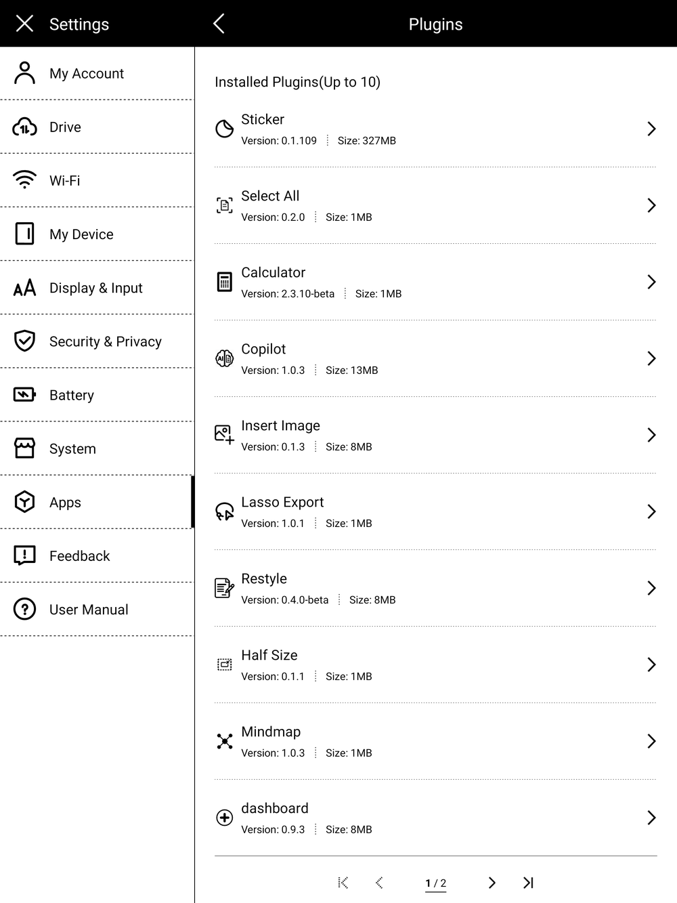 | 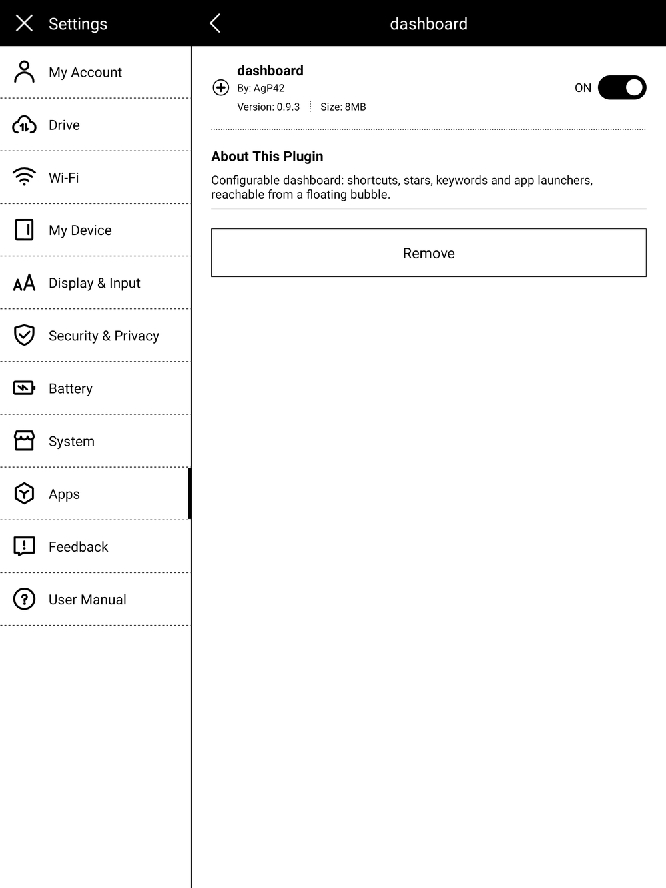 |

Open any note or document and tap the **Dashboard** button in the side toolbar to open Settings, or
activate the bubble.

---

## 2. The bubble

The dashboard's **⊖** button folds it into a small floating **⊕ bubble** (opening a note or shortcut
from the dashboard also leaves it running as the bubble). It floats over everything — notes,
folders, apps, settings.

- **Tap** → your dashboard opens full‑screen.
- **Drag** it anywhere; it stays where you leave it.

Its look — and turning it **Off** — is chosen in Settings → *Look* → Bubble. Turn it **Off** to use
only the toolbar **Dashboard** button. **Before uninstalling the plugin, set the bubble to Off** so
it doesn't linger on screen (otherwise a reboot clears it).

| ⊕ only | ⊕ + label | ⊕ + hint |
|---|---|---|
| 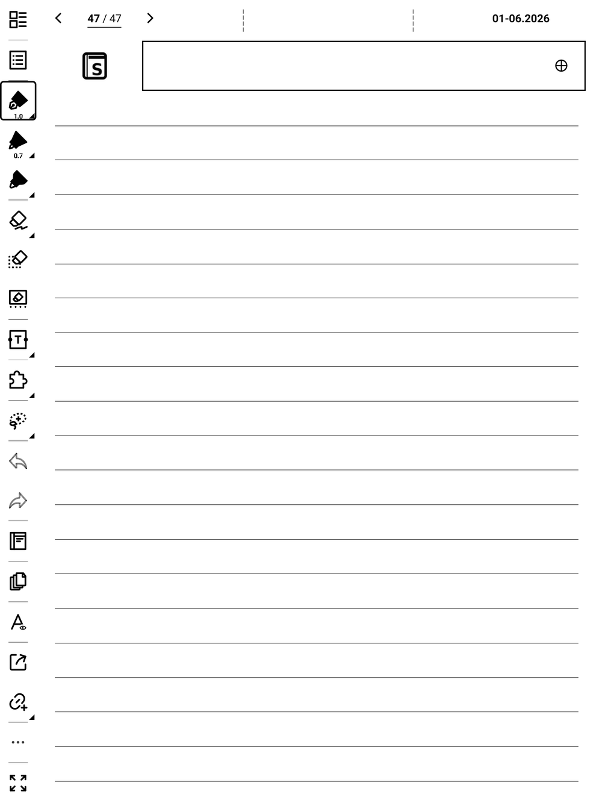 | 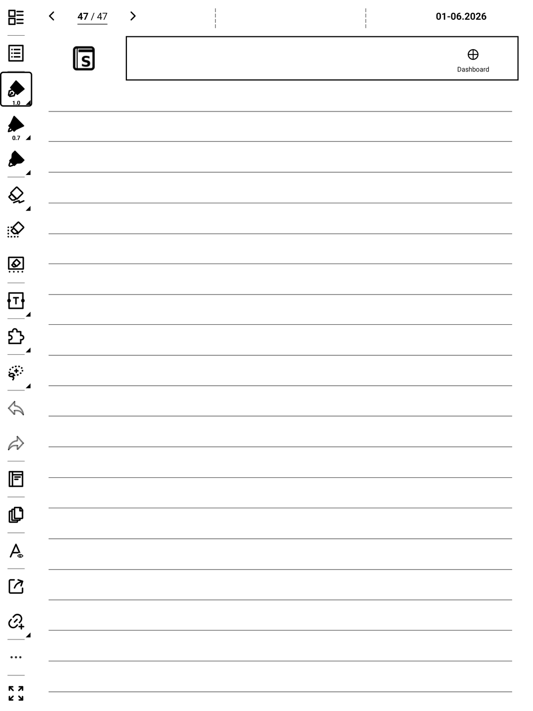 | 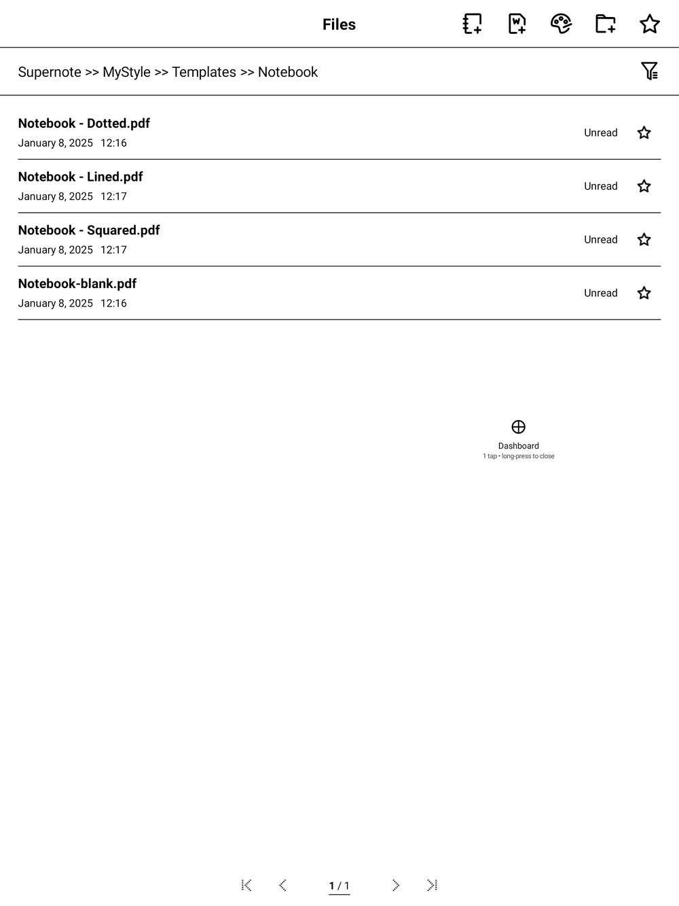 |

---

## 3. The dashboard

The dashboard is a stack (or 2‑column masonry) of **sections**. Tap anything to act. Top‑left is a
**⚙** to open Settings (kept away from the busy right side); top‑right are **↻ Refresh all** and
**⊖** (fold back to the bubble).

- **Shortcuts** — a folder (opens the file manager there), a note, or a PDF (opens the document).
  Lay them out as a list, a grid, or inline.
- **Recent** — your recently‑opened notes & PDFs, read live from the device (no scan needed). Supernote
  only tracks the **last 8** opened files, so this section shows **8 at most** (the count option tops out
  there).
- **Stars** — every starred (★) page from the last scan, grouped by note. Each star is a tappable
  row; a **✕★** can delete just that star (see §5).
- **Keywords** — your notes' keywords, shown as tappable **chips**; each chip opens that exact
  note + page.
- **Apps** — buttons that launch ToDo, Calendar, Document, Search, Files… (or any installed app via
  *Show all apps*).

---

## 4. Building your dashboard (Settings)

Open Settings from the toolbar **Dashboard** button, or the **⚙** on the dashboard. It's a **3‑step
wizard**; every change **saves automatically**. The header always shows **↺ Reset all** and
**▤ Save/load config** (see §6), and a **✕** to close. **▦ Save & go to Dashboard** (bottom‑left) or
**Next →** move you along.

### Step 1 · Look

Pick the **layout** (1 or 2 columns), the **design** (Ledger / Boxed / Airy, previewed on your
layout), the **bubble** style, and the **text size** (bigger = easier finger taps).

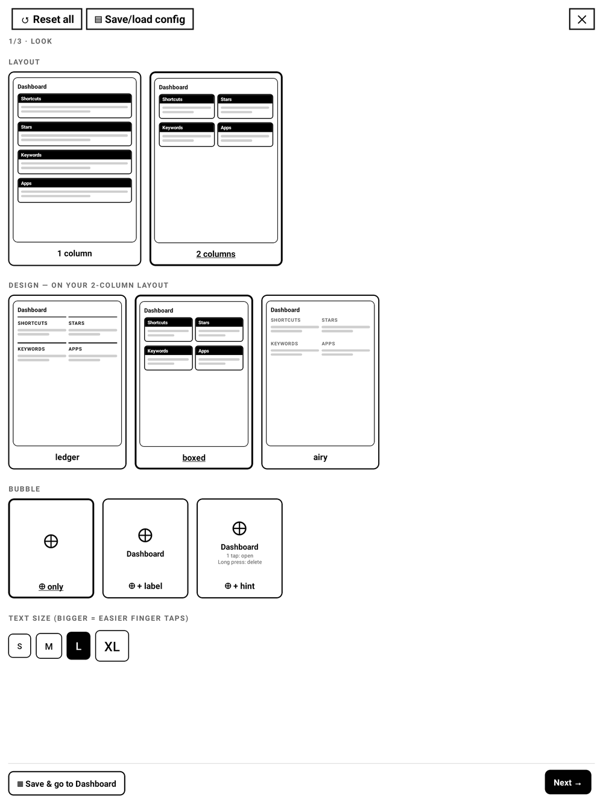

### Step 2 · Sections

A **live preview** of your page and the list of sections. **＋** add a section (Shortcuts / Stars /
Keywords / Apps / Recent — you can have several of the same kind), **▲▼** reorder, **✕** remove.

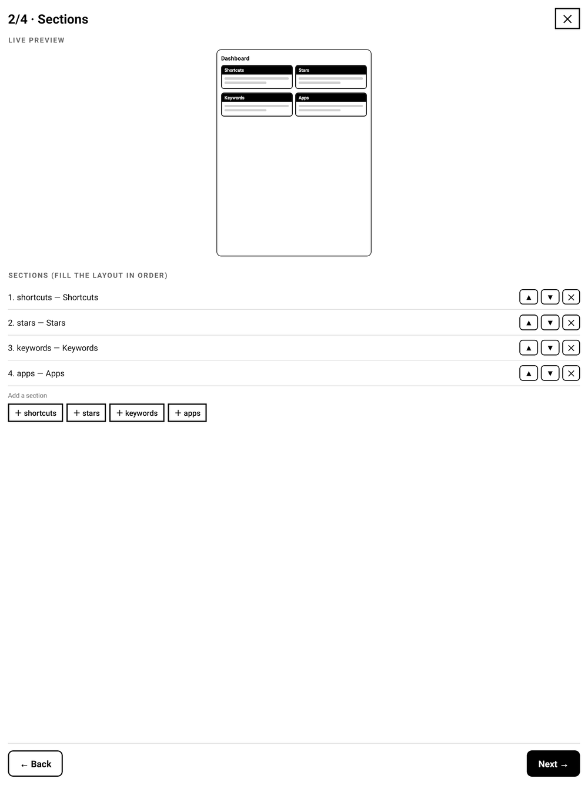

### Step 3 · Content

Configure each section: the **refresh** policy, rename any section (**✎ edit**), pick **shortcut**
targets (**＋ Add folder / note / PDF** — a full‑page multi‑select browser, see §7), choose **scan
folders** and **note order** for Stars/Keywords, the keyword grouping, and the Stars **line preview**
(see §5).

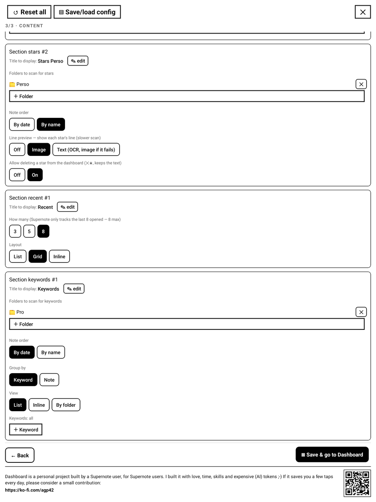

---

## 5. Stars: line preview & delete

For each starred page you can optionally show what's written **on the star's line** — set **Line
preview** on a Stars section to:

- **Off** — just `p.N`.
- **Image** — the actual **handwriting** of the line (always legible).
- **Text** — **OCR** to text where the recognizer can read it, and it **falls back to the handwriting
  image** for any line it can't. Best of both.

| Image | Text (OCR) | Text with image fallback |
|---|---|---|
| 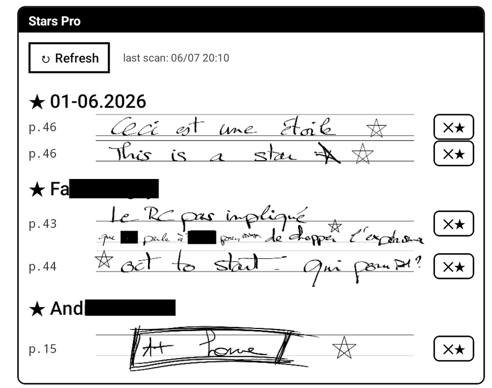 | 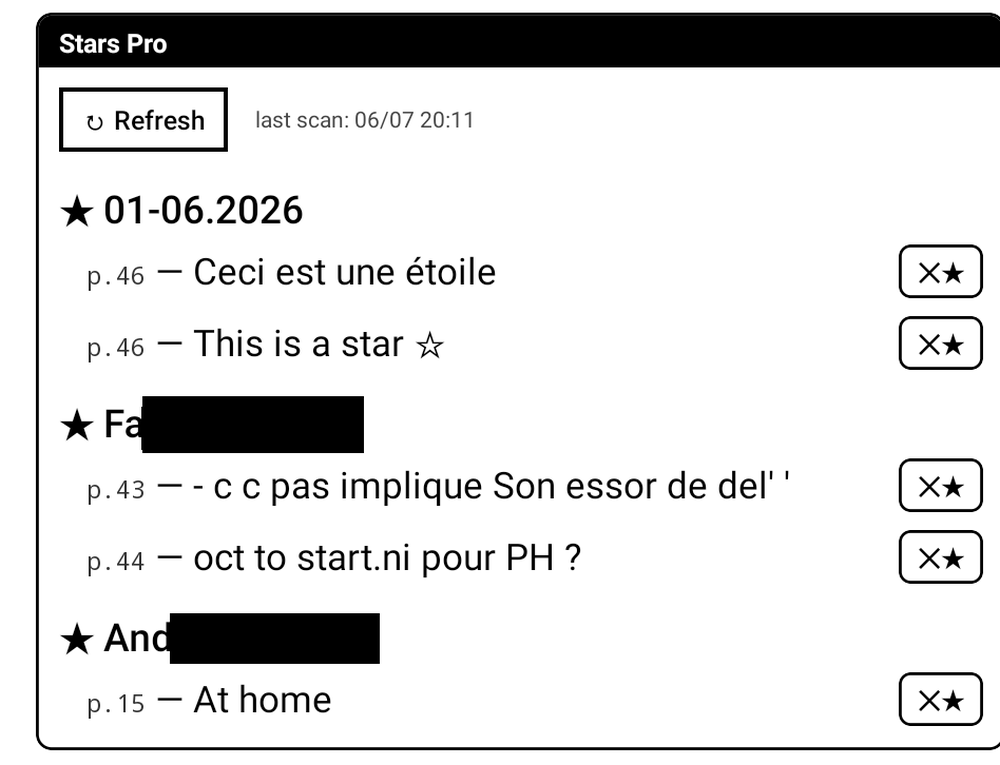 | 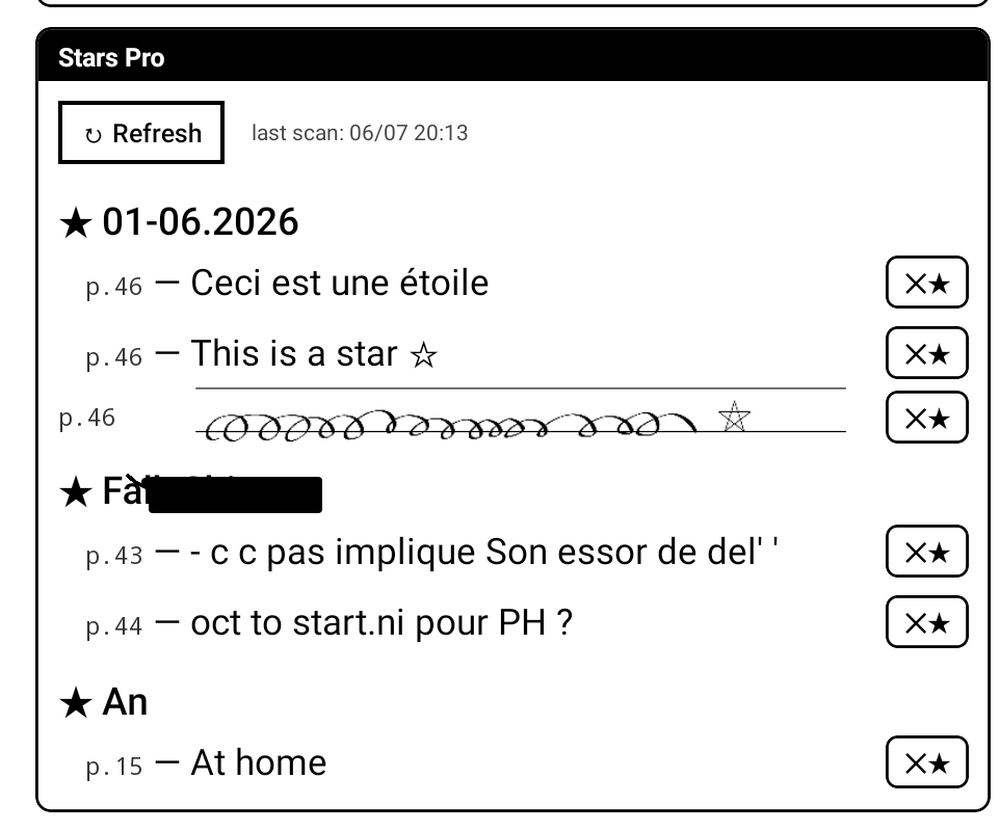 |

Turn on **Allow deleting** to get a **✕★** next to each star — it removes **just that five‑star**
(your handwriting is kept), after a confirmation.

> The line preview OCRs/renders per star, so it makes the scan slower — it only runs for notes that
> changed since the last scan.

---

## 6. Save / load configurations

The header's **▤ Save/load config** saves your whole dashboard under a name and reloads it anytime —
handy before experimenting, or to recover after an accidental **↺ Reset all**. Profiles live in
`MyStyle/Plugins/Dashboard/profiles.json`.

---

## 7. Adding shortcuts (multi‑select browser)

**＋ Add folder / note / PDF** opens a **full‑page browser**: navigate anywhere, tap notes/PDFs to
select several at once, **＋** a folder to add it, then **Save (N)** adds them all in one go.

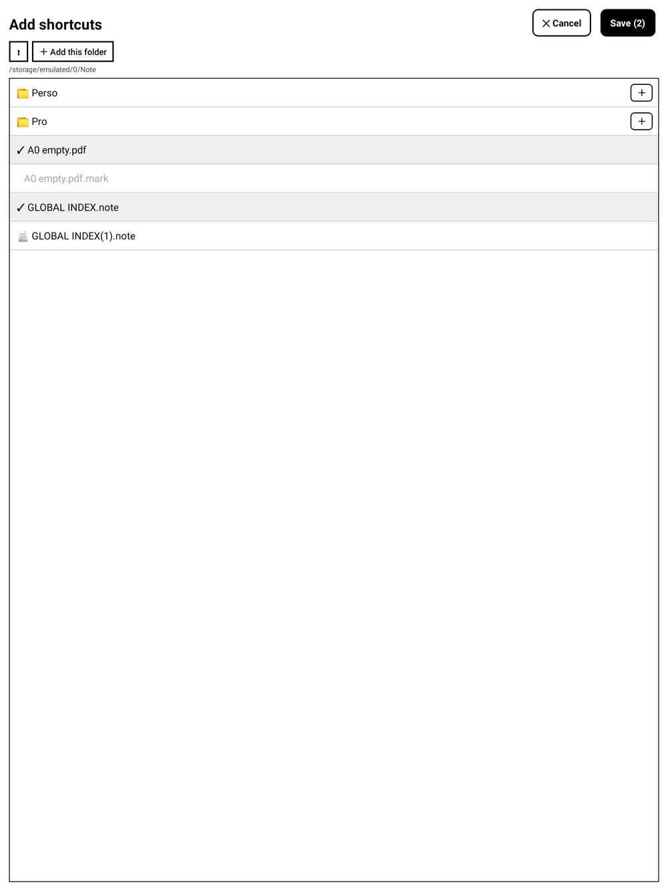

---

## 8. Scanning

Stars and Keywords come from scanning your notes. Each section shows its **last scan** time and a
**↻ Refresh** button; **↻ Refresh all** (dashboard header) refreshes every section. The scan is
**incremental** — the first scan of a folder set is slow, but afterwards only files you've **edited**
are re‑scanned, so later scans are near‑instant. Sections that scan the **same folders** share one
scan. Tip: point Stars/Keywords at `/Note` (or a subfolder) rather than the whole device for speed.

---

## 9. Advanced

The whole configuration is a JSON file at **`MyStyle/Plugins/Dashboard/config.json`** — power users
can edit it directly. The wizard writes the same file.

---

## 10. Good to know / limits

- **PDF pages**: a PDF opens on its last‑used page (jumping to a page isn't available yet).
- **Stars/keywords in PDFs** aren't listed (the system only exposes them for notes).
- **New stars/keywords** on the page you're editing appear after you **turn the page** (the editor
  saves on page‑turn/close).
- **Search** launches the native search but can't be pre‑filled.
- If a **stray bubble** ever appears (e.g. after reinstalling), open the plugin once — it clears
  leftover bubbles — or set **Bubble = Off** in Settings → Look.
