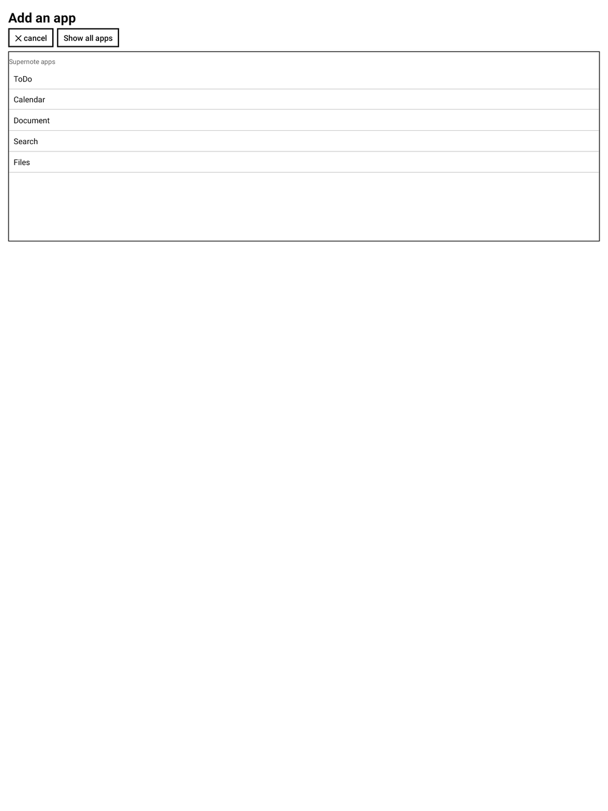
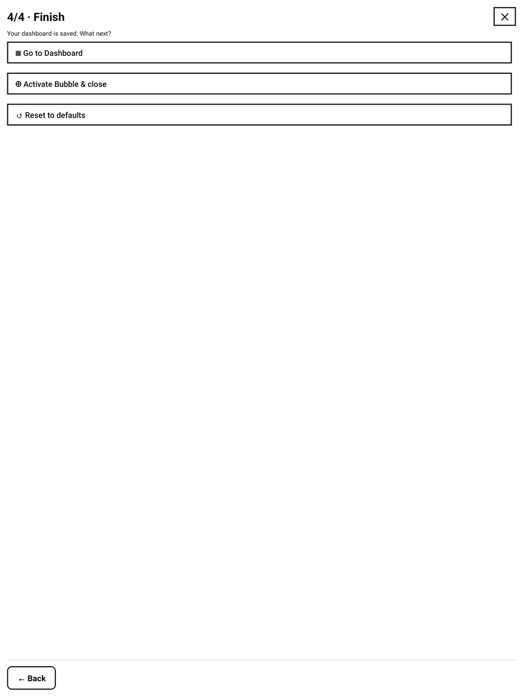

# Dashboard for Supernote — User Guide

Dashboard turns a floating **⊕ bubble** into a launcher for your Supernote: one tap opens a
dashboard you compose yourself from **shortcuts**, **stars**, **keywords** and **app** sections.
It runs fully on‑device and offline.

> Requires the Supernote developer/beta firmware with the plugin system. Works on A5X, A5X2 (Manta)
> and Nomad.

---

## 1. Install

1. Copy `dashboard.snplg` (from `dist/` or the Releases) into the **`MyStyle`** folder on your
   Supernote (USB, or the Partner app).
2. On the device: **Settings → Apps → Plugins → Add Plugin → dashboard**.

| Plugins list | Plugin details |
|---|---|
|  |  |

Once installed, open any note or document and tap the **Dashboard** button in the side toolbar to
open Settings (below), or activate the bubble.

---

## 2. The bubble

From the wizard's **Finish** step, choose **Activate Bubble & close** — a small **⊕ bubble** now
floats over everything (notes, folders, apps, settings…).

- **Tap** the bubble → your dashboard opens full‑screen.
- **Drag** it anywhere; it stays where you leave it.
- **Long‑press** it → it closes (re‑activate it later from Settings).

It has three looks (chosen in Settings → *Look*):

| ⊕ only | ⊕ + label | ⊕ + hint |
|---|---|---|
|  |  |  |

> The bubble lives while the plugin is running (after you've opened a note this session). A device
> reboot clears it — just re‑activate it once.

---

## 3. The dashboard

The dashboard is a stack (or 2‑column grid) of **sections**. Tap anything to act:

- **Shortcuts** — a folder (opens the file manager there), a note, or a PDF (opens the document).
- **Stars** — every starred (★) page from the last scan, grouped by note; a page with several stars
  shows `p.4 ×6`. Tap a page → the note opens there.
- **Keywords** — your notes' keywords, shown as tappable **chips**; each chip opens that exact
  note + page.
- **Apps** — buttons that launch ToDo, Calendar, Document, Search…

Top‑right of the dashboard: **⚙** (open Settings) and **⊖** (fold back to the bubble).

---

## 4. Building your dashboard (Settings)

Open Settings from the toolbar **Dashboard** button, or the **⚙** on the dashboard. It's a **4‑step
wizard** — each **Next** saves automatically (so **← Back** and **✕** never lose anything). **✕**
(top‑right) closes the plugin.

### Step 1 · Look

Pick the **layout** (1 or 2 columns), the **design** (Ledger / Boxed / Airy, previewed on your
layout), and the **bubble** style.

### Step 2 · Sections

A **live preview** of your page, and the list of sections. **＋** add a section (Shortcuts / Stars /
Keywords / Apps — you can have several of the same kind), **▲▼** reorder, **✕** remove.

### Step 3 · Content

Configure each section — set the **refresh** policy, rename any section (**✎ edit**, press *Done* to
save), pick **shortcut** targets (**＋ Folder / ＋ Note / ＋ PDF**, browse anywhere), choose **scan
folders** and **note order** for Stars/Keywords, and the keyword **Group by** / **View**.

Adding an app offers a curated **Supernote apps** list (plus *Show all apps*):

### Step 4 · Finish

**Go to Dashboard**, **Activate Bubble & close**, or **Reset to defaults**.

---

## 5. Scanning

Stars and Keywords come from scanning your notes. Scanning is **on demand**: each section shows its
**last scan** time and a **↻ Refresh** button with progress. It auto‑refreshes on first view, when
stale, or on every open — your choice per the *Refresh* setting. Sections that scan the **same
folders** share a single scan. With **no folder selected**, the whole device is scanned.

---

## 6. Advanced

The whole configuration is a JSON file at **`MyStyle/Plugins/Dashboard/config.json`** — power users
can edit it directly (folders, titles, keyword selections, etc.). The in‑app wizard writes the same
file.

---

## 7. Good to know / limits

- **PDF pages**: a PDF opens on its last‑used page (jumping to a specific page isn't available yet).
- **Stars/keywords in PDFs** aren't listed (the system only exposes them for notes).
- **Search** launches the native search but can't be pre‑filled.
- If a **stray bubble** ever appears (e.g. after reinstalling), open the plugin once — it clears
  leftover bubbles — or long‑press to dismiss it.
